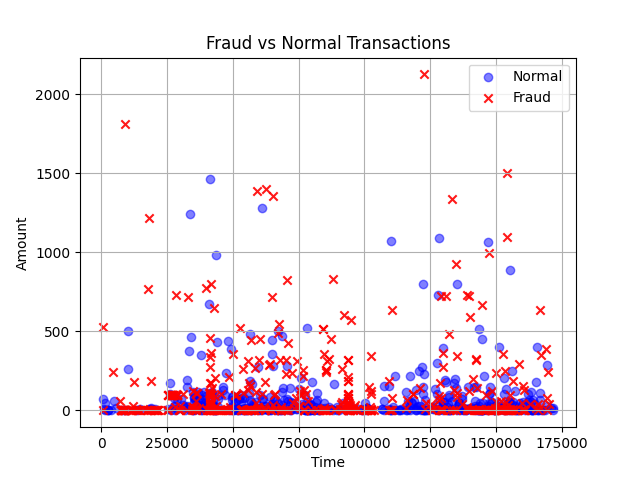
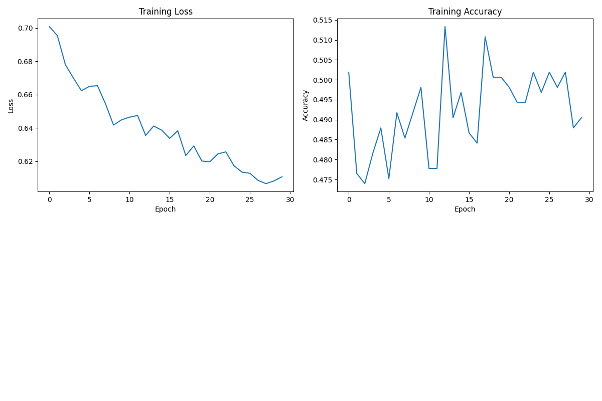
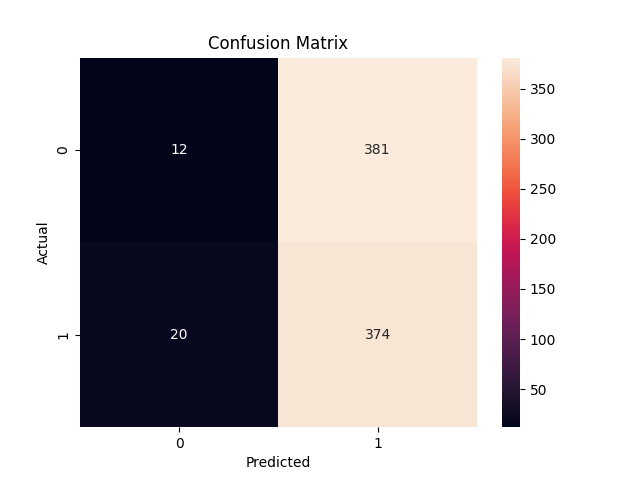

# 🚀 Fraud Detection using Hybrid GNN + Transformer with Streamlit Dashboard

## 📌 Overview

This project implements a **Hybrid Deep Learning Framework** for detecting fraudulent transactions using:

* 🧠 **Graph Neural Networks (GNN)** → captures relationships between transactions
* ⏱️ **Transformer Networks** → captures temporal patterns
* 🌐 **Streamlit App** → interactive real-time fraud detection dashboard

---

## 🧠 Model Architecture

```
Transaction Data
      ↓
Preprocessing & Balancing
      ↓
Graph Construction (GNN)
      ↓
Transformer (Temporal Learning)
      ↓
Feature Fusion (Hybrid Model)
      ↓
Fraud Classification (Fraud / Normal)
```

---

## 🌐 Interactive Application

Built using Streamlit

### Features:

* 📊 Data visualization (Fraud vs Normal)
* 📈 Training graphs (Loss & Accuracy)
* 🧠 Confusion matrix analysis
* ⚡ Real-time fraud prediction
* 📌 Model metrics dashboard

---

## 📊 Dataset

We used the **Credit Card Fraud Detection Dataset**

⚠️ Dataset not included due to size limits

👉 Download:
https://www.kaggle.com/datasets/mlg-ulb/creditcardfraud

📂 Place in:

```
data/creditcard.csv
```

---

## ⚙️ Technologies Used

* Python 🐍
* PyTorch 🔥
* PyTorch Geometric
* Scikit-learn
* Matplotlib & Seaborn 📈
* Streamlit 🌐

---

## 🚀 How to Run

### 1️⃣ Install dependencies

```bash
pip install torch torchvision torchaudio
pip install torch-geometric pandas numpy scikit-learn matplotlib seaborn streamlit
```

### 2️⃣ Run training pipeline

```bash
python -m utils.preprocess
```

### 3️⃣ Launch Streamlit App

```bash
streamlit run app.py
```

---

## 📊 Visualization

### Fraud Distribution



### Training Performance



### Confusion Matrix



---

## 📈 Evaluation Metrics

* Accuracy
* Precision
* Recall (Most important for fraud detection 🚨)
* F1 Score

---

## 🧠 Confusion Matrix Insights

* True Positives → Correct fraud detection
* False Negatives → Missed fraud (critical)
* False Positives → False alerts
* True Negatives → Correct normal detection

👉 **Goal:** Minimize False Negatives

---

## ⚡ Key Features

✔ Hybrid GNN + Transformer model
✔ Handles imbalanced fraud data
✔ Real-time prediction system
✔ Interactive dashboard
✔ Advanced visualization & analysis

---

## 🔥 What Makes This Project Unique

* Combines **relational + temporal learning**
* Provides **interactive UI with live prediction**
* Includes **detailed performance analysis**
* Demonstrates **real-world applicability**

---

## 📂 Project Structure

```
FraudDetection/
│
├── data/                # dataset (not uploaded)
├── models/              # GNN, Transformer, Hybrid
├── utils/               # preprocessing & graph builder
├── app.py               # Streamlit app
├── combined_graphs.png
├── confusion_matrix.png
├── fraud_visualization.png
├── README.md
```

---

## 👨‍💻 Author

**Adarsh M**
B.Tech CSE (AIML)

---

## 📄 Future Work

* Real-time API deployment
* Explainable AI dashboard
* Integration with banking systems
* Cloud deployment

---

## ⭐ Conclusion

This project demonstrates how combining **Graph Neural Networks** and **Transformer architectures** with an **interactive dashboard** significantly improves fraud detection and usability in real-world systems.

---
