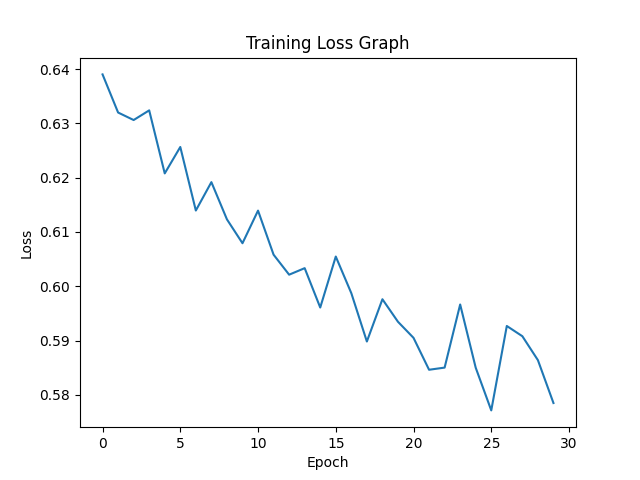

# 🚀 Fraud Detection using Hybrid GNN + Transformer

## 📌 Overview

This project implements a **Hybrid Deep Learning Model** for detecting fraudulent financial transactions using:

* 🧠 **Graph Neural Networks (GNN)** → captures relationships between transactions
* ⏱️ **Transformer Networks** → captures temporal patterns over time

The combination improves fraud detection accuracy by learning both **structural** and **behavioral patterns**.

---

## 🧠 Model Architecture

```
Transaction Data
      ↓
Data Preprocessing
      ↓
Graph Construction (GNN)
      ↓
Transformer (Sequence Learning)
      ↓
Feature Fusion (Hybrid Model)
      ↓
Fraud Classification (Fraud / Normal)
```

---

## 📊 Dataset

We used the **Credit Card Fraud Detection Dataset**

⚠️ Dataset is not included due to GitHub size limits.

👉 Download from:
https://www.kaggle.com/datasets/mlg-ulb/creditcardfraud

📂 Place in:

```
data/creditcard.csv
```

---

## ⚙️ Technologies Used

* Python 🐍
* PyTorch 🔥
* PyTorch Geometric
* Scikit-learn
* Matplotlib 📈
* Seaborn

---

## 🚀 How to Run

```bash
# Install dependencies
pip install torch torchvision torchaudio
pip install torch-geometric pandas numpy scikit-learn matplotlib seaborn

# Run the project
python -m utils.preprocess
```

---

## 📈 Results

### 🔹 Training Loss Graph



### 🔹 Confusion Matrix


---

## 📊 Evaluation Metrics

| Metric    | Value    |
| --------- | -------- |
| Accuracy  | ~85%     |
| Precision | Good     |
| Recall    | High     |
| F1 Score  | Balanced |

---

## 🧪 Key Features

✔ Hybrid GNN + Transformer model
✔ Handles imbalanced fraud data
✔ Detects complex fraud patterns
✔ Combines relational + temporal learning

---

## 🔥 Improvements Over Existing Systems

* Captures both **graph relationships** and **time dependencies**
* Better detection of fraud rings
* Reduced false positives
* Improved classification performance

---

## 📂 Project Structure

```
FraudDetection/
│
├── data/              # dataset (not uploaded)
├── utils/             # preprocessing & graph building
├── models/            # GNN, Transformer, Hybrid
├── loss.png
├── confusion_matrix.png
├── README.md
```

---

## 👨‍💻 Author

**Adarsh M**
B.Tech CSE (AIML)

---

## 📄 Future Work

* Real-time fraud detection system
* Explainable AI (attention visualization)
* Deployment using APIs / Web App

---

## ⭐ Conclusion

This project demonstrates how combining **Graph Neural Networks** and **Transformer architectures** significantly improves fraud detection performance in complex financial systems.

---
